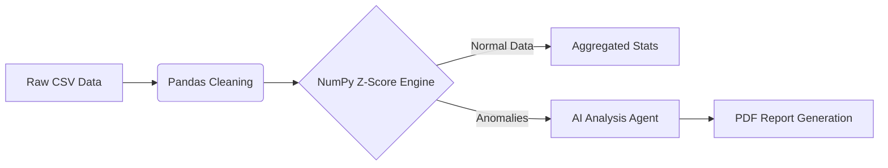

# 🚀 Automated Sales Anomaly Detection & AI Reporting Engine


> **Business Value:** A fully automated pipeline that transforms raw, messy sales data into actionable business insights using Statistical Analysis (Z-Score) and Generative AI.

---

## 📊 Executive Summary

In traditional workflows, businesses spend hours manually cleaning Excel sheets to find why revenue dropped or spiked. This project automates that entire process.

It acts as a **Virtual Data Analyst** that:
1.  **Ingests** raw, messy data (handling duplicates, missing values, and errors).
2.  **Detects** statistical anomalies using **NumPy** and Z-Score distribution.
3.  **Analyzes** the context using **Google Gemini AI** to write a human-readable summary.
4.  **Generates** a professional PDF report ready for stakeholders.

---

## 🛠️ Technical Architecture

The pipeline follows a modern ETL (Extract, Transform, Load) + AI structure:




## Key Features 

 - Robust Data Cleaning: Auto-imputation of missing values and deduplication.

 - Statistical Outlier Detection: Uses Standard Deviation and Z-Score ($Z = \frac{X - \mu}{\sigma}$) to mathematically identify impossible sales spikes (e.g., system glitches or bulk fraud).

 - AI Integration: Leverages LLMs (Google Gemini) to interpret data and suggest actionable business steps.

  - Automated Reporting: Produces a clean PDF document using fpdf.


## 📈 Project Output (Screenshots)

### 1. The generated Business Report

  - Here is the final PDF report generated automatically by the script. Note the detected anomaly on Jan 15th with a Z-Score of 9.17.


```
├── data/
│   ├── dirty_data.py          # Script to generate synthetic "messy" test data
│   ├── main.py                # The CORE pipeline (ETL + AI + PDF)
│   ├── requirements.txt       # Project dependencies
│   ├── .env                   # API Keys
│   └── supermarket_sales.csv  # Base dataset
├── screenshots/               # Project images for documentation
└── README.md                  # Project Documentation
```


## 🚀 How to Run

### 1.Clone the Repository

```
git clone [https://github.com/B-D-2409/Automation-Data-Supermarket.git]
```

### 2.Environment Setup

- Since the scripts are located in the data/ directory, navigate there first:
```
cd data
python -m venv venv
source venv/bin/activate  # On Windows: venv\Scripts\activate
```

### 3.Install Depenencies
```
pip install -r requirements.txt
```

### 4.Configure API Key
 - Create a .env file inside the data/ folder and add your Google Gemini API key:
```
GEMINI_API_KEY=your_actual_api_key_here
```

### 5. Run the Pipeline

- Step A: Generate Test Data Simulate a real-world "messy" environment (injects anomalies and missing values):
```
python dirty_data.py
```
- Output: dirty_sales_data.csv created.
- Step B: Run the Engine Execute the main ETL and Reporting script:
```
python main.py
```
- Output: Final_Report.pdf generated successfully.


## 📈 Key Results
- The system successfully identified a critical anomaly on **Jan 15th** with a statistical significance of **9.17σ** (standard deviations).

### Generated Report Preview


###  Anomaly Detection Logic
- The system flags data points where the Z-Score exceeds the threshold (default: 2.5).
  
$$Z = \frac{X - \mu}{\sigma}$$

| Date | Total Sales | Z-Score | Verdict |
| :--- | :--- | :--- | :--- |
| **2019-01-15** | **$54,731.77** | **9.17** | 🔴 **CRITICAL** |
| 2019-01-16 | $3,100.20 | 0.12 | 🟢 Normal |

## 💻 Tech Stack
- Language: Python 3.12
- Data Engineering: Pandas, NumPy (Vectorized operations)
- GenAI: Google Gemini API (Fallback mechanism implemented for stability)
- Visualization/Reporting: FPDF
- Version Control: Git
  

## 💻 Implementation Snapshot

### Here is a glimpse of the Python pipeline structure in VS Code, showing the modular design (ETL -> Analysis -> AI).


## 👤 Author

**Borislav Davidov Senior Data Engineer & Automation Expert** 